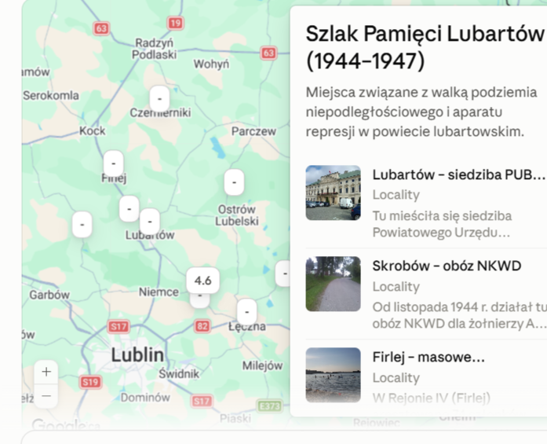
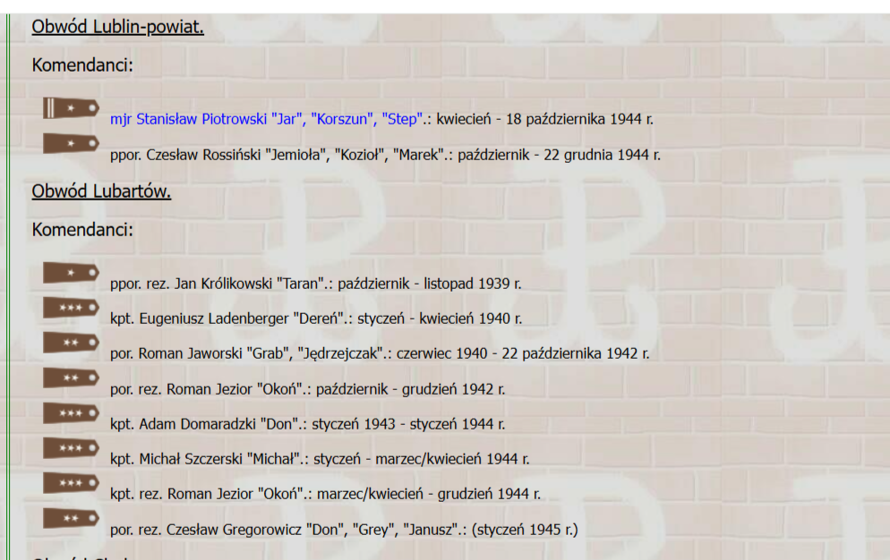

# Podziemie niepodległosciowe

Oto kompleksowe, gotowe opracowanie historyczno-edukacyjne na potrzeby **„Lubartowskiego Szlaku Pamięci”**, przygotowane na podstawie dostarczonego materiału i badania dr. hab. Sławomira Poleszaka.

Struktura została zaprojektowana z myślą o scannability (przejrzystości pod kątem przewodników i paneli informacyjnych) oraz bezpośrednim wykorzystaniu w Decap CMS lub na tablicach informacyjnych w terenie.

## 1. Wykaz Punktów Pamięci (Struktura Szlaku)

| **Nr** | **Nazwa Punktu** | **Lokalizacja / Współrzędne** | **Kluczowy Kontekst Historyczny** |
| --- | --- | --- | --- |
| **1** | **Siedziba Komendy Obwodu AK Lubartów** | Lubartów (Centrum) | Punkt mobilizacyjny i dowodzenia ponad 4 tys. konspiratorów w lipcu 1944 r.   |
| **2** | **Siedziba PUBP w Lubartowie** | ul. Nowodworska, Lubartów | Dawny urząd skarbowy; centrum śledcze i katownia UB od sierpnia 1944 r.   |
| **3** | **I Specjalny Obóz NKWD/ND WP** | Skrobów k. Lubartowa | Obóz internowania i filtracji żołnierzy AK wywożonych w głąb ZSRR.   |
| **4** | **Rejon Masowych Aresztowań (Wigilia 1944)** | Firlej | Miejsce grudniowej fali aresztowań 74 członków podziemia i sztabu BiP.   |
| **5** | **Miejsce Starcie pod Uciekajką** | Uciekajka (gm. Ludwin) | Bitwa 25 partyzantów z 200-osobową grupą operacyjną NKWD z czołgami (25.03.1945).   |
| **6** | **Miejsce Zasadzki pod Bojkami** | Bojki k. Ostrowa Lubelskiego | Zaskoczenie zmęczonego oddziału „Uskoka” przez siły Włodawskiego UB/NKWD (13.05.1945).   |
| **7** | **Centrum Rozbicia Rejonu V WiN** | Samoklęski / Kamionka | Miejsce pęknięcia sieci konspiracyjnej wskutek fali aresztowań na przełomie 1945/1946.   |
| **8** | **Bunkier i Miejsce Śmierci kpt. „Uskoka”** | Dąbrówka k. Łęcznej | Symboliczny finał oporu zbrojnego na Ziemi Lubartowskiej (21.05.1949).   |

## 2. Syntetyczna Tablica Statystyczna (1944–1947)

- **Potencjał podziemia w lipcu 1944 r.:** ok. **4 000** zaprzysiężonych żołnierzy w Obwodzie AK Lubartów (~4,4% ogółu mieszkańców powiatu).
- **Bilans represji komunistycznych (sierpień – grudzień 1944):**
    - ok. **500** zatrzymanych mieszkańców powiatu.
    - **169** żołnierzy AK wywiezionych do obozów i łagrów w ZSRR.
- **Efekty Akcji Amnestyjnej (wiosna 1947):** **892** osoby ujawnione na terenie powiatu (w tym 147 formalnych członków AK-WiN oraz 364 dezerterów z ludowego WP).
- **Skala działań operacyjnych UB/KBW (1944–1947):**
    - **456** większych akcji policyjno-wojskowych.
    - **157** zabitych członków AK-WiN.
    - **1 675** zatrzymanych osób (z czego ponad połowa w samym 1946 r.).
    - **113** zabitych funkcjonariuszy UB, milicjantów oraz żołnierzy KBW.

## 3. Opracowanie Postaci i Profil Biograficzny Aparatu Represji vs. Podziemia

### Podziemie Niepodległościowe (Dowódcy i Działacze)

- **ppor./kpt. Zdzisław Broński „Uskok”:** Dowódca oddziału dyspozycyjnego AK/DSZ/WiN. Mimo ciężkich strat pod Uciekajką i Bojkami prowadził walkę zbrojną najdłużej w regionie. Zginął w otoczonym bunkrze w Dąbrówce 21 maja 1949 r.
- **Dionizy Daniewski „Kruk”:** Komendant Rejonu V (Samoklęski). Jego aresztowanie w grudniu 1945 r. i wymuszone zeznania zapoczątkowały reakcję łańcuchową, która doprowadziła do rozbicia sztabu Obwodu WiN.
- **Edward Jezior „Julek”:** Kwatermistrz, a następnie ostatni Prezes Obwodu WiN Lubartów od listopada 1946 r. Zdekonspirowany na początku 1946 r., został zwolniony z braku dowodów i powrócił do podziemia, unikając ponownego aresztowania.

### Kierownictwo i Śledczy PUBP w Lubartowie

- **Mikołaj Demczuk / Aleksander Żebrun:** Pierwsi szefowie PUBP (pochodzenia ukraińskiego), bez wykształcenia i doświadczenia operacyjnego, opierający się w pełni na tzw. *sowietnikach* (doradcach z NKWD).
- **Marian Dworecki:** Szef Sekcji Walki z Bandytyzmem (pochodzenia żydowskiego, były uciekinier z obozu jenieckiego i partyzant AL). W charakterystykach służbowych opisywany jako pracownik wymuszony – rozkazy wykonywał ze strachu przed antysemityzmem i groźbą ze strony podziemia. W 1946 r. wyemigrował do Izraela.
- **Marian Radomski:** Miejscowy stolarz ze skromnym wykształceniem, który dzięki sumienności i pracy agenturalnej (zwerbował m.in. F. Kasperka „Hardego”) awansował na szefa Referatu III, a po latach do stopnia kapitana SB.



# **Szlak Pamięci Lubartów**

## **Ludzie i metody. Jak rozbito podziemie niepodległościowe (1944–1947)**

*Opracowanie historyczne na potrzeby lubartowskiego szlaku pamięci*

---

Lubartów, choć w okresie międzywojennym należał do jednych z najuboższych powiatów województwa lubelskiego, stał się po lipcu 1944 roku areną jednego z bardziej dramatycznych rozdziałów powojennej historii Polski – walki polskiego podziemia niepodległościowego z narzucanym siłą aparatem komunistycznym. Ten szlak pamięci prowadzi przez miejsca, wydarzenia i losy ludzi, którzy przez niespełna trzy lata – od wkroczenia Armii Czerwonej latem 1944 roku do zakończenia akcji amnestyjnej wiosną 1947 roku – decydowali o tym, jak wyglądała ta walka po obu jej stronach.

## **1. Powiat, który nie chciał się poddać**

Przed wojną powiat lubartowski liczył około 108 tysięcy mieszkańców, z czego niemal 90 procent stanowili Polacy, a największą mniejszość – licząca ok. 10 tysięcy osób – tworzyli Żydzi, skupieni głównie w Lubartowie i Łęcznej. Wojna i Zagłada zmieniły ten obraz nieodwracalnie: jesienią 1944 roku ludność powiatu liczyła już tylko ok. 91 tysięcy osób, niemal etnicznie jednorodną.

To właśnie tu, na terenach porośniętych Lasami Parczewskimi, Kozłowieckimi i Lasem Zawieprzyckim, działał jeden z najsilniejszych obwodów Armii Krajowej w Okręgu Lubelskim – Obwód AK Lubartów, liczący w lipcu 1944 roku ok. 4 tysiące zaprzysiężonych żołnierzy. To ponad 4 procent całej społeczności powiatu – wskaźnik zaangażowania konspiracyjnego wyraźnie wyższy niż w sąsiednich terenach.

**Punkty na szlaku:** Lubartów (siedziba Komendy Obwodu), tereny Lasów Parczewskich i Kozłowieckich, wieś Skrobów.

## **2. Nowa władza się instaluje**

Sowieci, wkraczając latem 1944 roku, natychmiast zaczęli budować własny porządek. W Lubartowie, w budynku dawnego urzędu skarbowego przy ulicy Nowodworskiej, już na początku sierpnia 1944 roku zaczęto organizować Powiatowy Urząd Bezpieczeństwa Publicznego (PUBP). Przez kolejne niespełna trzy lata funkcję jego kierownika pełniły cztery osoby: Mikołaj Demczuk, Aleksander Żebrun, Aleksander Moniuk i Lucjan Łykus – w większości ludzie młodzi, słabo wykształceni, o rodowodzie chłopskim, z których dwóch deklarowało narodowość ukraińską.

Kluczową rolę w pierwszym roku istnienia urzędu odgrywali tak zwani doradcy sowieccy – oficerowie prowadzący pracę operacyjną i śledczą, których miejscowi funkcjonariusze mieli dopiero się uczyć. W Lubartowie byli to m.in. kapitanowie Achczagnirow, Klujew i Afanasjew. Od listopada 1944 roku w pobliskim Skrobowie działał obóz NKWD dla żołnierzy AK, przekształcony później w tzw. I Specjalny Obóz Zarządu Informacji Naczelnego Dowództwa WP.

**Punkty na szlaku:** dawny budynek urzędu skarbowego przy ul. Nowodworskiej (siedziba PUBP), obóz NKWD w Skrobowie.

## **3. Jesień 1944: fala aresztowań**

Od sierpnia do grudnia 1944 roku struktury Wojsk Wewnętrznych NKWD, przy współpracy z tworzonym dopiero UB, prowadziły masowe aresztowania. Według relacji dowódcy oddziału partyzanckiego Zdzisława Brońskiego „Uskoka” w regionie pojawiły się oddziały NKWD, które przy pomocy miejscowych informatorów wyłapywały ludzi według sporządzonych list, a aresztowanych wywożono w nieznane miejsca.

Skala represji rosła z tygodnia na tydzień. Do początku grudnia 1944 roku aresztowano ok. 300 mieszkańców powiatu, miesiąc później liczba ta sięgnęła już 460 osób. Dane samej Armii Krajowej mówią o 186 akowcach aresztowanych bądź zabitych między sierpniem a grudniem 1944 roku, z czego 169 wywieziono jako internowanych do obozów w głębi ZSRR. Szczególnie boleśnie ucierpiał Rejon IV (Firlej) – w Wigilię 1944 roku aresztowano tam niemal połowę spośród 74 zatrzymanych członków AK.

8 grudnia 1944 roku w ręce UB wpadli niemal wszyscy pracownicy Biura Informacji i Propagandy Obwodu, w tym adwokat Aleksy Kin „Michał”, Karol Skaruch „Warta” oraz delegat rządu londyńskiego na powiat Bronisław Andrzejewski – wszyscy trzej związani ze Stronnictwem Narodowym.

**Punkty na szlaku:** Firlej (miejsce masowych aresztowań w grudniu 1944), miejsca pamięci związane z Biurem Informacji i Propagandy.

## **4. Ludzie aparatu represji**

Artykuł źródłowy, na którym oparto niniejsze opracowanie, przynosi rzadko spotykaną w tego typu narracjach szczegółowość biograficzną funkcjonariuszy UB. Warto ją przywołać, bo pokazuje mechanizm, jaki stał za budową lokalnego aparatu represji.

Sekcją śledczą kierował początkowo Bolesław Gan, a od listopada 1944 roku wspierał go Ryszard Charliński – student prawa KUL, który już w sierpniu 1945 roku odszedł z UB, by po latach samemu trafić w tryby śledztwa: aresztowany w 1951 roku pod zarzutem przekazania działaczom WiN informacji o składzie osobowym PUBP, został skazany na cztery lata więzienia. Podobny los, choć z innych powodów, spotkał Józefa Nieścioruka, który kierował sekcją śledczą w kluczowych latach 1946–1947, a w latach 50. sam trafił przed sąd za zatajenie własnej służby w oddziałach AK.

Na czele komórki odpowiedzialnej za walkę z „bandytyzmem” (czyli podziemiem zbrojnym) stali kolejno: Marian Dworecki (pochodzenia żydowskiego, uciekinier z obozu pracy dla jeńców, później partyzant GL–AL), Józef Soroka (Ukrainiec, przedwojenny działacz komunistyczny więziony za działalność w Komunistycznym Związku Młodzieży Zachodniej Ukrainy) oraz Marian Radomski, jedyny spośród nich miejscowy, syn działacza komunizującej „Samopomocy Chłopskiej”.

To właśnie w charakterystyce Dworeckiego pojawia się jedno z najbardziej wymownych zdań całego dokumentu: jego przełożony pisał, że rozkazy wykonuje, bo musi – w przeciwnym razie grozi mu śmierć ze strony „reakcyjnych elementów”, tak jak Żydowi. Zdanie to dobrze oddaje logikę systemu, w którym przynależność etniczna funkcjonariusza bywała jednocześnie narzędziem kontroli nad nim.

Dworecki został zresztą oceniony jako pracownik słaby i w 1946 roku wyemigrował do Izraela. Soroka, przeniesiony do Lubartowa z obawy o jego bezpieczeństwo (jego ojciec i szwagier zostali wcześniej zabici przez żołnierzy AK), odniósł tu wymierny sukces operacyjny, po czym awansował do WUBP w Lublinie – by w 1949 roku zostać zwolnionym dyscyplinarnie za wydanie w latach 30. towarzyszy w ręce przedwojennej policji. Tylko Radomski, oceniany początkowo jako mierny intelektualnie, dosłużył się stopnia kapitana SB i pracował aż do swojej tragicznej śmierci w wypadku motocyklowym w 1966 roku.

## **5. Odrodzenie podziemia i partyzantka leśna**

Ofensywa styczniowa 1945 roku, przesuwająca front na zachód, dała lokalnemu podziemiu chwilowy oddech. Odbudowano trzy oddziały partyzanckie: Zdzisława Brońskiego „Uskoka”, Wiktora Targońskiego „Brzozy” i Józefa Szymuli „Wulkana”/„Jordana”, a wiosną 1946 roku dołączył do nich oddział Kazimierza Woźniaka „Szatana”. W 1945 roku partyzanci rozbili posterunki milicji w Abramowie, Czemiernikach, Leszkowicach, Ludwinie, Łęcznej, Niedźwiadzie, Rudnie, Sernikach i Spiczynie.

Ale to właśnie ten okres przyniósł oddziałowi „Uskoka” dwie najboleśniejsze klęski. 25 marca 1945 roku we wsi Uciekajka nad jeziorami Pojezierza Łęczyńsko-Włodawskiego ponad dwustuosobowa grupa operacyjna NKWD, wsparta czołgami, zaskoczyła 25 partyzantów – siedmiu zginęło, kilkudziesięciu mieszkańców wsi aresztowano. 13 maja 1945 roku w Bojkach koło Ostrowa Lubelskiego zmęczony po poprzedniej akcji oddział „Uskoka” został zaskoczony przez kolejną grupę operacyjną – stracił czterech zabitych i utracił znaczną część uzbrojenia.

**Punkty na szlaku:** Uciekajka (gm. Ludwin), Bojki koło Ostrowa Lubelskiego, Lasy Zawieprzyckie (miejsce dużej obławy z lipca 1946 roku, wymierzonej w oddziały mjr. „Zapory” i „Uskoka”).

## **6. „Wsypa” przełomu 1945/1946 roku**

Największy sukces operacyjny lubartowskiej bezpieki przyszedł na przełomie 1945 i 1946 roku. 22 grudnia 1945 roku, na podstawie zeznań aresztowanego wcześniej komendanta Rejonu V Dionizego Daniewskiego „Kruka”, rozpoczęto lawinowe aresztowania. Do 18 stycznia 1946 roku zatrzymano 27 osób – w tym szefa propagandy Romana Mikę „Skibę”, łącznika Wincentego Czapnika „Witka” i kwatermistrza Edwarda Jeziora „Julka”. Sztab obwodu i cały Rejon V przestały praktycznie istnieć.

Los Edwarda Jeziora jest szczególnie wymowny: zwolniony z braku dostatecznych dowodów, wrócił do konspiracji i w listopadzie 1946 roku, po aresztowaniu prezesa Obwodu WiN Jana Tadeusza Pudełki „Czesława”, sam objął tę funkcję – pełniąc ją aż do zakończenia działalności podziemia wiosną 1947 roku. Nigdy nie został ponownie aresztowany.

**Punkty na szlaku:** Rejon V Samoklęski, miejsce działalności komendy Obwodu WiN.

## **7. Amnestia 1947 roku – koniec zorganizowanego oporu**

Wiosną 1947 roku przeprowadzona akcja ujawnienia ostatecznie złamała struktury podziemia w powiecie. Dane są rozbieżne – od 672 do 892 osób, które się ujawniły, przy czym tylko 147 przyznało się wprost do działalności w AK-WiN. Reszta wolała figurować jako dezerterzy lub uchylający się od służby wojskowej, licząc na łagodniejsze traktowanie. W całym województwie lubelskim ujawniło się blisko 12 tysięcy osób.

Kierownictwo lubartowskiego WiN nie skorzystało z amnestii. Ostatnich jego działaczy aresztowano na początku maja 1947 roku, skazując ich wyrokiem Wojskowego Sądu Rejonowego w Lublinie z 15 lipca 1947 roku na kary od 5 do 8 lat więzienia.

Zbrojny opór jednak nie wygasł całkowicie. „Uskok” dowodził swoją grupą aż do 21 maja 1949 roku, gdy otoczony w bunkrze w Dąbrówce koło Łęcznej, odebrał sobie życie granatem. Ostatnia, już schyłkowa grupa Mariana Strzeleckiego „Borysa” działała jeszcze jesienią 1950 roku.

**Punkty na szlaku:** Dąbrówka koło Łęcznej – miejsce śmierci „Uskoka”, symboliczny finał zbrojnego oporu w regionie.

## **8. Bilans**

Wewnętrzne opracowanie Służby Bezpieczeństwa z lat 80. XX wieku szacuje, że w latach 1944–1947 na terenie powiatu lubartowskiego przeprowadzono 456 „większych akcji” przeciwko podziemiu, w wyniku których zginęło 157 członków AK-WiN, a zatrzymano 1675 osób – z czego ponad połowa przypadła na sam rok 1946. Po stronie aparatu represji śmierć poniosło ośmiu funkcjonariuszy UB, 78 milicjantów i 27 żołnierzy KBW.

Za tymi liczbami kryją się konkretne ludzkie losy – i te po stronie podziemia, i te po stronie aparatu bezpieczeństwa, w wielu przypadkach równie tragiczne, choć z zupełnie innych powodów. Szlak pamięci Lubartów nie ma na celu upraszczania tej historii do jednej narracji – ma przypominać, że za każdym z tych miejsc i nazwisk stoi historia konkretnego człowieka, uwikłanego w czasy, których sam nie wybrał.

---

*Opracowanie przygotowane na podstawie: Sławomir Poleszak, „Ludzie i metody. Rozbijanie podziemia niepodległościowego w Lubartowskiem (lipiec 1944 – kwiecień 1947)”, Studia Polityczne 2023, tom 51, nr 1, Instytut Studiów Politycznych PAN.*

“Kierownictwo lubartowskiego WiN-u nie skorzystało z możliwości ujawnienia. Dlatego też miejscowa „bezpieka” kontynuowała jego rozpracowywanie. Do zatrzymań doszło na początku maja 1947 r. W areszcie znaleźli się [m.in](http://m.in/).: ofi cer wywiadu Tadeusz Jakubas „Dąb”, (pracownik Spółdzielni Spożywców „Społem” w Lubartowie), zastępca komendanta obwodu Wojciech Słaboń „Sokół”; szefowa OPUS Helena Danielewicz „Maria” (urzędniczka skarbowa w Lubartowie)85. WSR w Lublinie wyrokiem z 15 lipca 1947 r. skazał ich na kary od 5 do 8 lat więzienia86. Z dowództwa lubartowskiego WiN-u ujawnił się Kazimierz Zawada „Woda”. W trzy dni po ujawnieniu jako były komendant obwodu podpisał odezwę, w której namawiał swoich byłych podkomendnych do skorzystania z możliwości amnestii87. Prezes miejscowego WiN Edward Jezior „Julek” nie ujawnił się, nie został też aresztowany na początku maja 1947 r.88. Z obliczeń funkcjonariuszy SB wynika, że w okresie od września 1945 do 4 maja 1947 r. pracownicy operacyjni PUBP w Lubartowie aresztowali 128 działaczy WiN-u, z czego 38 osób postawiono przed sądem. Pozostali na podstawie amnestii z 22 lutego 1947 r. zostali zwolnieni89. Ujawnienie struktur WiN-u na terenie powiatu nie zakończyło walki zbrojnej z władzą komunistyczną. Pomimo że nie miała ona żadnych szans powodzenia, to te nieliczne siły partyzanckie skupiały na sobie uwagę funkcjonariuszy UB i pododdziałów KBW. „Uskok” dowodził grupą do swojej śmierci 21 maja 1949 r., kiedy otoczony w bunkrze w Dąbrówce koło Łęcznej, rozerwał się granatem90. Pozostałościami ….

| **Imię i nazwisko / Pseudonim** | **Funkcja w konspiracji (WiN)** | **Rola cywilna / Zawód** | **Dalsze losy / Represje** |
| --- | --- | --- | --- |
| **Kazimierz Zawada „Woda”** | Komendant Obwodu AK/WiN Lubartów | Kierownik w Powiatowym Komitecie Opieki Społecznej | Uciekł przed aresztowaniem w styczniu 1946 r. Ujawnił się podczas amnestii wiosną 1947 r. i wydał odezwę do podkomendnych o składanie broni. |
| **Tadeusz Jakubas „Dąb”** | Oficer wywiadu Obwodu WiN | Pracownik Spółdzielni Spożywców „Społem” w Lubartowie | Aresztowany przez UB 4 maja 1947 r. Skazany przez WSR w Lublinie na 8 lat więzienia. Zmarł w więzieniu w Rawiczu 8 kwietnia 1950 r. |
| **Wojciech Słaboń „Sokół”** | Zastępca komendanta Obwodu WiN | Działacz konspiracji regionalnej | Aresztowany w maju 1947 r., skazany wyrokiem WSR na karę od 5 do 8 lat więzienia. |
| **Helena Danielewicz „Maria”** | Szefowa OPUS (Opieka Społeczna / Łączność) | Urzędniczka Urzędu Skarbowego w Lubartowie | Aresztowana w majowej fali zatrzymań 1947 r., skazana przez WSR na karę więzienia. |
| **Edward Jezior „Julek”** | Kwatermistrz, od XI 1946 r. ostatni Prezes Obwodu WiN | Urzędnik Państwowego Zakładu Ubezpieczeń Wzajemnych | Zatrzymany w styczniu 1946 r. i zwolniony z braku dowodów. Powrócił do konspiracji, przejął dowodzenie obwodem, uniknął ponownego aresztowania. |

Oficer wywiadu Zrzeszenia „Wolność i Niezawisłość” (WiN) w Obwodzie Lubartów. Na co dzień pracownik Spółdzielni Spożywców „Społem”. Po odmowie ujawnienia się w amnestii 1947 r. został aresztowany przez PUBP w Lubartowie 4 maja 1947 r. Wyrokiem Wojskowego Sądu Rejonowego w Lublinie skazany na długoletnie więzienie. Zmarł tragicznie podczas odbywania kary w więzieniu w Rawiczu 8 kwietnia 1950 r.

Oto szczegółowe zestawienie historyczne **kluczowych postaci ze sztabu i kierownictwa Obwodu WiN Lubartów** (oraz pionów pomocniczych) przygotowane pod kątem nowych wpisów do bazy i szlaku:

| **Imię i nazwisko / Pseudonim** | **Funkcja w konspiracji (WiN)** | **Rola cywilna / Zawód** | **Dalsze losy / Represje** |
| --- | --- | --- | --- |
| **Kazimierz Zawada „Woda”** | Komendant Obwodu AK/WiN Lubartów | Kierownik w Powiatowym Komitecie Opieki Społecznej | Uciekł przed aresztowaniem w styczniu 1946 r. Ujawnił się podczas amnestii wiosną 1947 r. i wydał odezwę do podkomendnych o składanie broni. |
| **Tadeusz Jakubas „Dąb”** | Oficer wywiadu Obwodu WiN | Pracownik Spółdzielni Spożywców „Społem” w Lubartowie | Aresztowany przez UB 4 maja 1947 r. Skazany przez WSR w Lublinie na 8 lat więzienia. Zmarł w więzieniu w Rawiczu 8 kwietnia 1950 r. |
| **Wojciech Słaboń „Sokół”** | Zastępca komendanta Obwodu WiN | Działacz konspiracji regionalnej | Aresztowany w maju 1947 r., skazany wyrokiem WSR na karę od 5 do 8 lat więzienia. |
| **Helena Danielewicz „Maria”** | Szefowa OPUS (Opieka Społeczna / Łączność) | Urzędniczka Urzędu Skarbowego w Lubartowie | Aresztowana w majowej fali zatrzymań 1947 r., skazana przez WSR na karę więzienia. |
| **Edward Jezior „Julek”** | Kwatermistrz, od XI 1946 r. ostatni Prezes Obwodu WiN | Urzędnik Państwowego Zakładu Ubezpieczeń Wzajemnych | Zatrzymany w styczniu 1946 r. i zwolniony z braku dowodów. Powrócił do konspiracji, przejął dowodzenie obwodem, uniknął ponownego aresztowania. |

### 

**Postać:** `Tadeusz Jakubas "Dąb"`

- **Rola:** `Oficer Wywiadu Obwodu WiN Lubartów`
- **Lokacja / Miejsce pamięci:** `Lubartów / PSS Społem`
- **Opis biograficzny:**

Markdown

# 

```
Oficer wywiadu Zrzeszenia „Wolność i Niezawisłość” (WiN) w Obwodzie Lubartów. Na co dzień pracownik Spółdzielni Spożywców „Społem”. Po odmowie ujawnienia się w amnestii 1947 r. został aresztowany przez PUBP w Lubartowie 4 maja 1947 r. Wyrokiem Wojskowego Sądu Rejonowego w Lublinie skazany na długoletnie więzienie. Zmarł tragicznie podczas odbywania kary w więzieniu w Rawiczu 8 kwietnia 1950 r.
```

**Postać:** `Helena Danielewicz "Maria"`

- **Rola:** `Szefowa Komórki OPUS (Opieka nad Więźniami i Łączność) WiN`
- **Lokacja / Miejsce pamięci:** `Lubartów / Urząd Skarbowy`
- **Opis biograficzny:**

Markdown

# 

```
Urzędniczka skarbowa z Lubartowa, kierująca strukturą OPUS w cywilnym pionie podziemia niepodległościowego. Odpowiadała za legalizację, zaplecze socjalne oraz łączność. Aresztowana w majowej obławie UB w 1947 r., skazana przez sąd wojskowy w wyroku zbiorczym sztabu WiN na 5 lat więzienia.
```

### Propozycja nowego punktu na Szlaku:

- **Nazwa punktu:** `Dawna Siedziba PSS „Społem” i Urzędu Skarbowego w Lubartowie`
- **Kategoria:** Miejsca Pamięci / Cywilne Zaplecze Konspiracji
- **Kontekst:** Miejsca pracy i siatki wywiadowczo-łącznikowej cywilnego pionu WiN (T. Jakubas, H. Danielewicz), pokazujące uwikłanie lokalnej inteligencji i urzędników w opór cywilny przeciwko aparatowi bezpieczeństwa.



**Czesław Gregorowicz**

(ur. 1908)

Pseudonimy: „Grabina”, „Wojciech”, „Jaromir”, „Janusz”, „Grey”, „Don”.

Urodził się 14 sierpnia 1908 r. w Spiczynie (pow. Lubartów) w rodzinie rymarza. po ukończeniu Szkoły Powszechnej w Kijanach kontynuował naukę w IV Gimnazjum Miejskim w Warszawie, uzyskując w 1928 r. świadectwo maturalne. Następnie ochoczo zgłosił się do odbycia służby wojskowej. Początkowo kształcił się w Szkole Podchorążych Rezerwy Piechoty nr 9a w Łukowie, którą ukończył w 1929 r. w stopniu plutonowego podchorążego. W 1932 r. został awansowany przez Prezydenta RP do stopnia podporucznika. W grudniu 1939 r. nielegalnie przekroczył granicę sowiecką w Brześciu n. Bugiem. W styczniu 1940 r. wstąpił do ZWZ-AK. Początkowo pełnił funkcję komendanta rejonu I (Spiczyn–Ludwin–Łęczna–Niemce) w obwodzie lubartowskim AK, a pod koniec 1942 r. minowany został inspektorem WSOP obwodu. Od kwietnia 1944 r. pełnił obowiązki I zastępcy komendanta obwodu Lubartów, a podczas krótkotrwałego okresu Odtwarzania Sił Zbrojnych sprawował funkcję dowódcy 2 kompanii IV batalionu 8 PP Leg. W pierwszych dniach stycznia 1945 r. objął stanowisko komendanta obwodu Lubartów, a po rozwiązaniu Armii Krajowej kontynuował działalność konspiracyjną w ramach organizacji Nie i w Delegaturze Sił Zbrojnych na Kraj. Od września 1945 r. w strukturze organizacji Wolność i Niezawisłość sprawował funkcję komendanta obwodu na powiat lubelski. Jednocześnie był zastępcą inspektora rejonowego. Używał wówczas pseudonimów „Grey” i „Don”. We wrześniu 1946 r. został aresztowany i uwięziony. Zwolniony na mocy amnestii w kwietniu 1947 r., został ponownie aresztowany w 1953 r. i przez 9 miesięcy przetrzymywany był w areszcie. 24 lutego 1992 r. Sąd Wojewódzki w Lublinie unieważnił postanowienia Wojskowego Sądu Rejonowego z 1947 r. oraz Wojskowej prokuratury Rejonowej w Lublinie z 1953 r.

Po wojnie ukończył studia na Wydziale Prawa Uniwersytetu im. Adama Mickiewicza w Poznaniu, po czym odbył aplikację sądową w Sądzie Okręgowym w Lublinie, a w 1949 r. złożył egzamin sędziowski. Pracował wówczas w izbie Skarbowej, a następnie – do czasu przejścia na emeryturę , tj. do 1974 r. –w Prezydium Wojewódzkiej Rady Narodowej w Lublinie, dochodząc do stanowiska Zastępcy Dyrektora Wydziału Finansowego. Nie należał do żadnej partii politycznej.

Za działalność w szeregach AK został odznaczony Krzyżem Walecznych, Srebrnym Krzyżem Zasługi z Mieczami, Medalem Wojska oraz Krzyżem Oficerskim Orderu Odrodzenia Polski.

# **Książki autora:**


[**ZWZ-AK w obwodzie lubartowskim 1939-1945**](https://www.norbertinum.pl/ksiazka/742/ZWZ-AK-w-obwodzie-lubartowskim-1939-1945)

Opracowanie dziejów Armii Krajowej w obwodzie lubartowskim na Lubelszczyźnie.

[więcej o książce](https://www.norbertinum.pl/ksiazka/742/ZWZ-AK-w-obwodzie-lubartowskim-1939-1945)

:”” jesienią 1946 r. UB ujął [m.in](http://m.in/). prezesa Obwodu Lublin–Powiat por. Czesława Gregorowicza „Greja” (były komendant Obwodu AK Lubartów); inspektora lubelskiego kpt. Franciszka Abraszewskiego „Borutę” oraz dwie jego podkomendne; zastępcę prezesa okręgu ppłk. Jana Szatowskiego „Janusza”, a 7 listopada ujęto prezesa lubartowskiego WiN por. Jana Tadeusza Pudełko „Czesława”80. Funkcjonariusze UB mieli nadzieję, że pomoże im on w całkowitym zlikwidowaniu obwodu lubartowskiego WiN. Plan się nie powiódł, gdyż „Czesław” „podczas śledztwa był bardzo «skąpy»”81. Operacją, która ostatecznie złamała kręgosłup podziemia niepodległościowego, była przeprowadzona w marcu i kwietniu 1947 r. akcja ujawnienia. Istnieją poważne rozbieżności co do liczby ujawnionych na terenie powiatu lubartowskiego. Z niedatowanego raportu miejscowego PUBP wynika, że miały to być 672 osoby82. Natomiast z chronologicznie późniejszego opracowania statystycznego, a więc założyć należy, że zapewne o wiele dokładniejszego, możemy się dowiedzieć, że były to 892 osoby, z czego 147 osób ujawniło się jako członkowie AK-WiN83. Niewielka liczba ujawnionych, którzy przyznali się do działalności podziemnej, może świadczyć o tym, że część z nich wolała się ujawnić jako dezerterzy i uchylający się od służby w ludowym WP, sądząc, że tak będzie dla nich bezpieczniej. W wyniku amnestii na terenie województwa lubelskiego ujawniło się 11 970 osób, z czego 6105 osób (51 proc.) stanowić mieli członkowie AK, WiN i NSZ84.

(83) j.w/ J. Dudek, Amnestia jako środek walki aparatu bezpieczeństwa z podziemiem niepodległościowym na przykładzie Lubelszczyzny, w: Komunistyczne amnestie lat 1945–1947 – drogi do „legalizacji” czy zagłady?, red. W.J. Muszyński, IPN, Warszawa 2012, s. 219–224, 234; AIPN Lu 0201/4 Zestawienie statystyczno-opisowe dotyczące powstania i działalności reakcyjnego podziemia na terenie pow. Lubartów w latach 1944–1960, k. 15. Najliczniejszą grupę wśród ujawnionych stanowili dezerterzy (364), kolejną – osoby uchylające się od służby w ludowym WP (204) i „bandyci” (79).

Oto przygotowana, gotowa do publikacji praca (artykuł historyczny) oparta na przedstawionych źródłach naukowych i relacjach. Tekst jest napisany w przystępnym, wciągającym stylu, z zachowaniem ścisłej dyscypliny faktograficznej pod kątem publikacji na stronie lub w mediach społecznościowych **„Lubartowskiego Szlaku Pamięci”**.

# Ciemna grudniowa noc 1944 roku. Jak NKWD i UB rozbiły sztab lubartowskiej AK

Dla mieszkańców powiatu lubartowskiego przejście frontu w lipcu 1944 roku i wypchnięcie wojsk niemieckich nie przyniosło upragnionej wolności. Radość z udanych działań akcji „Burza” i wyzwolenia regionu siłami Armii Krajowej szybko ustąpiła miejsca nowej, brutalnej rzeczywistości. Już jesienią 1944 roku na Ziemię Lubartowską spadła pierwsza, niszczycielska fala komunistycznego terroru, której celem było całkowite unicestwienie Polskiego Państwa Podziemnego.

Najbardziej tragiczny bilans przyniósł okres od sierpnia do końca grudnia 1944 roku. Z danych podziemia wynika, że w ciągu tych kilku miesięcy aresztowano lub zamordowano aż **186 żołnierzy i działaczy AK** (personaliów 13 z nich nie udało się odtworzyć). Aż **169 osób** z tej grupy zostało następnie wywiezionych w latach 1944–1945 w głąb Związku Sowieckiego jako internowani w łagrach.

### Udowodnić, że Polska nie zginęła: Uderzenie w BIP

Sowiecki kontrwywiad „Smiersz”, pododdziały 64 Dywizji NKWD oraz tworzące się w budynku przy ul. Nowodworskiej w Lubartowie UB uderzyły ze szczególną bezwzględnością w grudniu 1944 roku. Człowiekiem, który w swoich pamiętnikach bezlitośnie punktował metody okupanta, był ppor. Zdzisław Broński „Uskok”. Pisał on o masowych obławach, wyłapywaniu ludzi według przygotowanych wcześniej list proskrypcyjnych oraz okrutnym traktowaniu zatrzymanych.

Czarnym dniem dla lubartowskiej konspiracji okazał się **8 grudnia 1944 roku**. W ręce bezpieki wpadła wówczas większość pracowników obwodowego **Biura Informacji i Propagandy (BIP)** – komórki odpowiedzialnej za podtrzymywanie ducha oporu i wydawanie wolnej prasy. Wśród aresztowanych znaleźli się:

- **adw. Aleksy Kin ps. „Michał”** – ceniony prawnik, pisarz i redaktor podziemnych gazetek oraz ulotek,
- **Karol Skaruch ps. „Warta”** – kluczowy współpracownik aparatu wydawniczego,
- **Bronisław Andrzejewski** – podziemny Delegat Rządu Londyńskiego na powiat lubartowski (konspiracyjny starosta).

Wszyscy trzej przed wojną i w czasie okupacji byli wybitnymi działaczami Stronnictwa Narodowego, co czyniło ich dla tworzącej się władzy komunistycznej wrogami numer jeden.

### Tragedia w Wigilię i aresztowanie legendarnych dowódców

Machina represji nie oszczędziła również pionu wojskowego. W tym samym okresie w ręce NKWD wpadł **ppor. Bolesław Mucharski ps. „Lekarz”** – były dowódca jednego z najbardziej zasłużonych oddziałów partyzanckich w regionie, który w lipcu 1944 r. odtwarzał 4 batalion 8 Pułku Piechoty Legionów AK. Bolesne straty poniosły także Bataliony Chłopskie, scalone wcześniej z Armią Krajową.

Szczególnie ponury przebieg miały wydarzenia w **Rejonie IV (Firlej)**. Pętla wokół tamtejszych struktur zaciskała się przez cały grudzień, doprowadzając do aresztowania 74 członków konspiracji. Symbolikę tamtych dni dopełnia fakt, że niemal połowę z nich Sowieci i funkcjonariusze UB schwytali i wyrwali z domów rodzinnych **w samą Wigilię 1944 roku**.

### Pamięć o wywiezionych

Dla zdecydowanej większości aresztowanych w grudniu 1944 roku drogą krzyżową stał się obóz filtracyjny NKWD w pobliskim Skrobowie, a następnie ciężkie wagony towarowe („bydlęce”), którymi transportowano ich do obozów internowania na terenie ZSRR (m.in. w Borowiczach, Riazaniu i Stalingradzie).

Grudniowy pogrom z 1944 roku był jednym z najcięższych ciosów zadanych Ziemi Lubartowskiej. Mimo rozbicia sztabu i wywiezienia elit niepodległościowych, pamięć o nich oraz wola oporu przetrwały w kolejnych latach w działaniach Zrzeszenia WiN.

*Artykuł powstał na potrzeby bazy edukacyjnej projektu „Lubartowski Szlak Pamięci” w oparciu o materiały źródłowe i opracowania naukowe dr. hab. Sławomira Poleszaka.*

Oto uzupełnienie artykułu o postać ppor. rez. Władysława Kostrzewy oraz rolę Państwowej Komisji Bezpieczeństwa (PKB) w strukturze lubartowskiego podziemia:

### Uderzenie w podziemną policję: ppor. Władysław Kostrzewa „Kość”

Wśród dziesiątek aresztowanych pod koniec 1944 roku żołnierzy i działaczy niepodległościowych znalazła się postać kluczowa dla podziemnego wymiaru sprawiedliwości i bezpieczeństwa cywilnego na Ziemi Lubartowskiej – **ppor. rez. Władysław Kostrzewa ps. „Kość”**.

Pełnił on funkcję komendanta obwodowego **Państwowej Komisji Bezpieczeństwa (PKB)** – podziemnej formacji policyjnej podległej Delegaturze Rządu na Kraj, utworzonej na bazie scalonych ze strukturami AK Batalionów Chłopskich. PKB odpowiadała za:

- ochronę ludności cywilnej przed pospolitym bandytyzmem i nadużyciami okupanta,
- wywiad i przeciwdziałanie represjom,
- zabezpieczanie podziemnego wymiaru sprawiedliwości.

Aresztowanie ppor. „Kości” przez aparat represji było elementem skrupulatnie zaplanowanego uderzenia w cywilne i polityczne zaplecze Polskiego Państwa Podziemnego w powiecie. Pokazywało jasno, że nowa władza komunistyczna eliminuje nie tylko oddziały czysto wojskowe, ale również tych, którzy tworzyli zręby legalnej administracji i praworządności podziemnej Rzeczypospolitej.

### 

**Postać:** `Władysław Kostrzewa "Kość"`

- **Rola:** `Podporucznik rez., Komendant Obwodowy Państwowej Komisji Bezpieczeństwa (PKB) / BCh`
- **Lokacja / Miejsce pamięci:** `Obwód Lubartów`
- **Opis biograficzny:**

Markdown

# 

```
Podporucznik rezerwy, działacz Batalionów Chłopskich scalonych z Armią Krajową[cite: 7]. W strukturach Polskiego Państwa Podziemnego pełnił funkcję komendanta obwodowego Państwowej Komisji Bezpieczeństwa (PKB) na powiat lubartowski[cite: 7]. Odpowiadał za bezpieczeństwo cywilne, przeciwdziałanie przestępczości i zaplecze organizacyjne konspiracji[cite: 7]. Aresztowany w trakcie wielkiej fali represji NKWD i UB pod koniec 1944 roku[cite: 7].
```

Oto gotowy fragment (zarówno jako akapit do artykułu, jak i nowa karta statystyczna do bazy), uzupełniający dane o strukturze i liczebności Obwodu AK Lubartów na podstawie źródeł archiwum IPN oraz monografii Czesława Gregorowicza i Dariusza Salaty:

### Uzupełnienie do Artykułu (Akapit):

> **Struktura i potencjał bojowy Obwodu AK Lubartów**
Sile i zasięgowi lubartowskiego podziemia dowodzić mogą szczegółowe zestawienia archiwalne z tamtego okresu. Jak wynika z ustaleń historyków (Cz. Gregorowicza i D. Salaty) oraz dokumentacji zgromadzonej w archiwach IPN (Charakterystyka Komendy Obwodu nr 108 opracowana przez B. Mazurka), w skład Obwodu AK Lubartów wchodziło aż **75 plutonów**. Skupiały one łącznie **4085 zaprzysiężonych konspiratorów**. Taka siła organizacyjna i terytorialna sprawiała, że powojenny aparat bezpieczeństwa od pierwszych dni traktował ziemię lubartowską jako jeden z głównych bastionów oporu niepodległościowego na Lubelszczyźnie.
> 

### Karta Statystyczno-Strukturalna (Format do CMS / Notion):

**Nazwa:** `Struktura Obwodu AK Lubartów (1939–1945)`

**Kategoria:** Baza Danych / Statystyki Konspiracji

- **Liczba plutonów w obwodzie:** `75 plutonów`
- **Łączna liczba zaprzysiężonych żołnierzy:** `4 085 konspiratorów`
- **Główne źródła archiwalne:**
    - AIPN Lu, 0136/163, *Charakterystyka nr 108 Komendy Obwodu Lubartów AK, 22 VIII 1944 – IX 1945*, oprac. B. Mazurek.
    - Cz. Gregorowicz, D. Salata, *ZWZ-AK w obwodzie lubartowskim 1939–1945*, Norbertinum, Lublin 1998, s. 237.

**Postać:** `Władysław Kostrzewa "Kość"`
  
• **Rola:** `Podporucznik rez., Komendant Obwodowy Państwowej Komisji Bezpieczeństwa (PKB) / BCh`
  
• **Lokacja / Miejsce pamięci:** `Obwód Lubartów`
  
• **Opis biograficzny:**

Podporucznik rezerwy, działacz Batalionów Chłopskich scalonych z Armią Krajową[cite: 7]. W strukturach Polskiego Państwa Podziemnego pełnił funkcję komendanta obwodowego Państwowej Komisji Bezpieczeństwa (PKB) na powiat lubartowski[cite: 7]. Odpowiadał za bezpieczeństwo cywilne, przeciwdziałanie przestępczości i zaplecze organizacyjne konspiracji[cite: 7]. Aresztowany w trakcie wielkiej fali represji NKWD i UB pod koniec 1944 roku[cite: 7].

Bibliografia:

 P. Gawryszczak, Podziemie polityczno-wojskowe…, s. 66, 71; J. Wrona, Adam Moździński – Nauczyciel, żołnierz, patriota, w: Lubartów i Ziemia Lubartowska, t. 17, Lubartowskie Towarzystwo Regionalne, Lubartów 2010, s. 258; Cz. Gregorowicz, D. Salata, ZWZ-AK w obwodzie…, s. 376–377.