# __Panteon Bohaterów_

## /“Panteon Bohaterów”

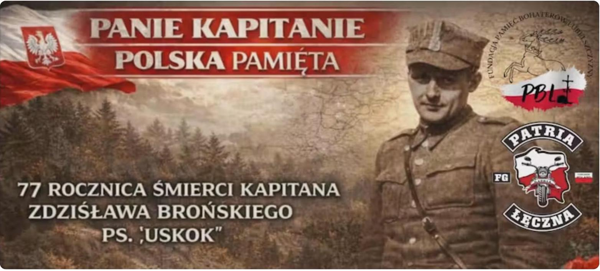

Concatenate(
thisRow.Stopień, ” “,
If(thisRow.Pośmiertnie=true,”(pośm.) “,”“),
thisRow.Imię,” “,
thisRow.Nazwisko,” „”,
thisRow.Pseudonim, ““”
)

## Panteon Bohaterów (Uporządkowana Tabela dla Cody)

Poniższa tabela zawiera dane rozdzielone na osobne kolumny. Pierwsza kolumna Imię i Nazwisko/ pseudonim zawiera wyłącznie zwięzłe dane identyfikacyjne (numer, stopień, imię, nazwisko i pseudonim). Dzięki temu po wklejeniu tych danych do Cody i ustawieniu tej kolumny jako Display Column, Twoje powiązania (Relation) będą wyglądać niezwykle czysto i profesjonalnie, a pełne biogramy będą wyświetlać się w dymkach szczegółów.

## Instrukcja wdrożenia w Codzie:

1. Skopiuj zawartość tej tabeli.
2. Wklej ją do nowo utworzonej tabeli w Codzie (lub zastąp istniejące wiersze).

3． Upewnij się，że kolumna Imię i Nazwisko／pseudonim jest ustawiona jako Display Column（ma ikonkę fioletowej flagi）．

Widok＿Panteon 2
| ■ Table ： | | | | | | | | | | | | | | | | |
| :— | :— | :— | :— | :— | :— | :— | :— | :— | :— | :— | :— | :— | :— | :— | :— | :— |
| Imie i Nazwisko／pseudonim | Fotografia | Biogram | Notes | Lokalizacja Pamiątkov | Button | Swiadkowie historii | i | Copy of Copy of Cc | Fotografie upamietn． | Select list | Kolejność automatycz | Stopień | Pełne dane | Słowa kluczowe | Opis | i Imie i pseudonim |
| 1．por．Józef Jurałomski Pseudonim：„Jur” Biogram：Komendant II Rejonu AK obejmującego Lubartow． Dowodca II Kompanii，ktora odegrała kluczową rolę w bezposrednim wyzwalaniu miasta w lipcu 1944 roku． Wybitny organizator struktur podziemnych na tym terenie． Słowa Klucze do Audio： Komendant Rejonu，Wyzwoliciel Lubartowa，Dowódca III Kompanii． |

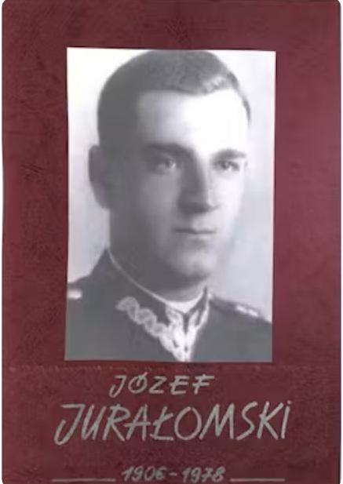

| | 日 | Cmentarz i Rondo，ul． Lubelska | Click me | 日 |

$f_{\bullet}$

| | 田 | |

$f_{\bullet}$

| |

$f_{\bullet}$

| | | |

| 2．por．rez．Czesław |  | E | Click me | 目 | $f_{\bullet}$ | E | $f_{●}$ | $f_{\bullet}$ |
| --- | --- | --- | --- | --- | --- | --- | --- | --- |
| Gregorowicz Pseudonim：„Jaromir” Biogram：Inspektor Wojskowej Służby Ochrony Powstania （WSOP）w Komendzie Obwodu AK Lubartow．Brał aktywny udział w walkach o miasto podczas Akcji „Burza”，dbając o bezpieczenstwo zaplecza i ludności cywilnej． Słowa Klucze do Audio： Inspektor WSOP，Akcja Burza， Bezpieczeństwo miasta． Opis wizualny ：Mężczyzna w mundurze wojskowym wzoru polskiego，na głowie rogatywka z orzełkiem，zdecydowane spojrzenie，twarz gładko ogolona． |  |  |  |  |  |  |  |  |
| 3．st．sierż．Stefan Rafalski Pseudonim：„Miech” Biogram：Doświadczony podoficer，szef III Kompanii Lubartów．Odpowiadał za logistykę，dyscyplinę i przygotowanie bojowe żołnierzy operujących bezpośrednio w mieście przed i w trakcie wyzwalania． Słowa Klucze do Audio：Szef Kompanii，Dyscyplina i wyszkolenie，Logistyka walki． |  | 日 | Click me | 田 | $f_{\bullet}$ | 日 | $f_{\bullet}$ | $f_{\bullet}$ |

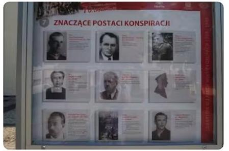

5 ．ppor．Józef Majerski（＂To on dostarczał dokumenty wywiadu dla planu ataku na Lubartów＂．）
Pseudonim：„Anastazy” Biogram：Oficer wywiadu Armii Krajowej w Obwodzie
Lubartowskim．Od lipca 1944 roku pełnił funkcję Zastępcy Komendanta II Rejonu， wspierając bezpośrednio działania operacyjne podczas wyzwalania miasta．Jego praca w wywiadzie była kluczowa dla bezpieczeństwa oddziałów „Jura”．
Słowa Klucze do Audio：Oficer Wywiadu，Zastępca
Komendanta Rejonu，
„Anastazy＂．

Adam Moździński
Pseudonim：„Świerk”
Biogram：Jeden z głównych
organizatorów struktur
konspiracyjnych ZWZ－AK w
Lubartowie．Redaktor i
wydawca podziemnego
biuletynu „Nasza Warta”，który
podtrzymywał ducha oporu
wśród mieszkańców．Po wojnie
wieloletni kronikarz i strażnik
pamięci o oddziałach AK w
regionie．
Słowa Klucze do Audio：
Organizator konspiracji，
Redaktor „Naszej Warty”，
Strażnik Pamięci．
Maria Jabłońska
Rola：Świadek historii，córka
Adama Moździńskiego．
Biogram：Przechowała i
udostępniła bezcenne
archiwum ojca oraz relacje
dotyczące wyzwolenia
Lubartowa．Jej wspomnienia o
wejściu oddziałów AK do
miasta w lipcu 1944 roku są
jednym z najbardziej
poruszających świadectw
cywilnych tamtych dni．
Słowa Klucze do Audio：Córka
„Świerka”，Relacja z
wyzwolenia，Archiwum
domowe．6．

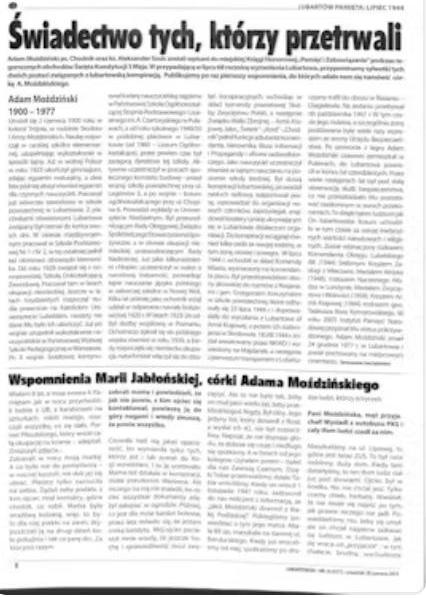

| 1．Stanisław Małyska | E | Click me | 日 | $f_{\bullet}$ | E | $f_{\bullet}$ | $f_{\bullet}$ |
| --- | --- | --- | --- | --- | --- | --- | --- |
| Pseudonim：（brak stałego pseudonimu operacyjnego w dokumentach，występuje jako działacz społeczny i kronikarz）． Biogram：Niezmordowany badacz i dokumentalista historii Lubartowa．Dzięki jego pracy archiwalnej i pasji wiele z tych nazwisk，które dziś wpisujemy do Cody，nie zostało zapomnianych． Słowa Klucze do Audio： Kronikarz Lubartowa，Strażnik Pamięci，Archiwista． |  |  |  |  |  |  |  |
| 2．por．Stefan Rafalski （uzupełnienie danych） Pseudonim：„Miech” Biogram：Szef III Kompanii Lubartów．Postać legendarna wśród żołnierzy za sprawą niezwykłej dbałości o zaplecze logistyczne i wyszkolenie młodych konspiratorów，którzy brali udział w wyzwalaniu miasta． Słowa Klucze do Audio：Szef Kompanii，Instruktor，Logistyk „Burzy”． | 日 | Click me | 日 | $f_{\bullet}$ | 日 | $f_{\bullet}$ | $f_{\bullet}$ |

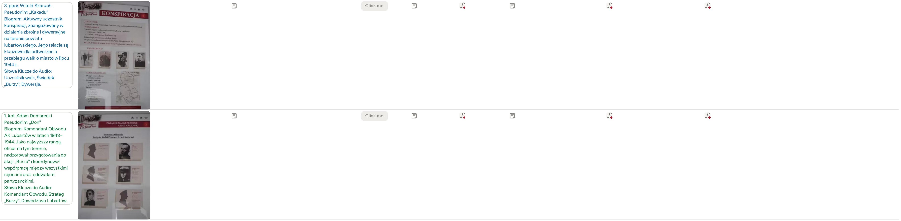

2．kpt．Eugeniusz Landenberger Pseudonim：„Dereń” Biogram：Komendant Obwodu Lubartów we wczesnej fazie konspiracji（1940 r．）．Jeden z pionierów budowania struktur podziemnych w regionie， odpowiedzialny za pierwsze formowanie kadr oficerskich． Słowa Klucze do Audio：Pionier konspiracji，Pierwszy Komendant，budowniczy struktur

3．kpt．Edmund Szczerski Pseudonim：„Michał” Biogram：I zastępca Komendanta Obwodu Lubartów oraz Komendant Obwodu w latach 1943－1944． Kluczowa postać w sztabie， odpowiedzialna za operacyjne planowanie walk i łaczność między plutonami w krytycznym momencie wyzwalania． Słowa Klucze do Audio： Zastępca Komendanta，Planista operacyjny，Dowódca sztabowy．

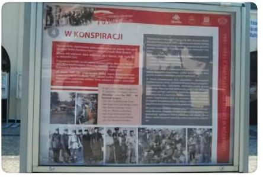

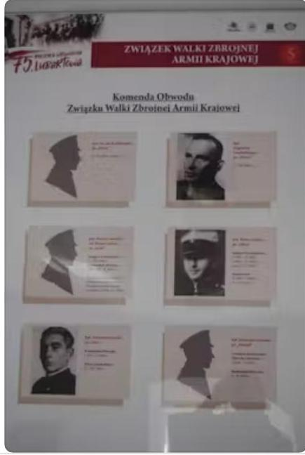

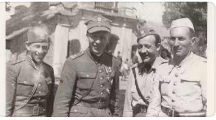

1．kpt．Kazimierz Rzaniak Pseudonim：„Garda” Biogram：Oficer 27．Wołyńskiej Dywizji Piechoty AK，dowódca zgrupowania，w skład którego wchodził batalion „Korda”． Odpowiedzialny za koordynację działań na styku Lubartowa i Kozłówki；brał udział w trudnych rozmowach z dowództwem sowieckim przed rozbrojeniem． Słowa Klucze do Audio： Dowódca Zgrupowania， 27. WDP AK，Rozmowy z sowietami． Opis wizualny ：Mężczyzna w pełnym umundurowaniu oficerskim，wysoka czapka rogatywka，pas główny z koalicyjką，postawa wyprostowana，twarz o ostrych， żołnierskich rysach．

2．por．rez．Jan Królikowski Pseudonim：„Taran” Biogram：Komendant Obwodu Lubartów w początkowym okresie（październik／listopad 1939－1940 r．）．Jeden z pierwszych organizatorów oporu zbrojnego na ziemi lubartowskiej，kładący podwaliny pod późniejszą strukturę AK． Słowa Klucze do Audio： Pierwszy organizator，„Taran”， Początki konspiracji． Opis wizualny Sylwetka mężczyzny w mundurze （zdjęcie profilowe），wyraźny zarys oficerskiej czapki，ujęcie o charakterze archiwalnym， kontrastowe．

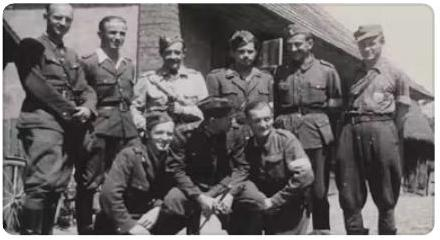

kap．．Roman Jezior
Pseudonim：„Okoń”
Biogram：Zastępca
Komendanta Obwodu（1941－
1943）oraz Komendant Obwodu
w 1944 roku．Dowodził
strukturami lokalnymi w
najbardziej gorącym okresie
walk o wyzwolenie powiatu
lubartowskiego．
Słowa Klucze do Audio：
Komendant 1944，„Okoń”，
Wyzwolenie powiatu．
Opis wizualny ：Mężczyzna w
mundurze z wyraźnym otokiem
na czapce，spojrzenie prosto w
obiektyw，młoda twarz，
widoczne pagony porucznika．
ks．kanonik Aleksander Szulc
ps．„Ina”：Kapelan Wojska
Polskiego，uczestnik kampanii
wrześniowej，a później
kluczowa postać lubartowskiej
konspiracji．

Tytuł：Akcja „Burza”－Wolność w Lubartowie Krótki Opis：＞„22 lipca 1944 r．Lubartów stał się wolny dzięki połączonym siłom lokalnej AK（plutony＇Uskoka＇， ＇Lekarza＇，＇Brzechwy＇）oraz legendarnej 27．Wołyńskiej Dywizji Piechoty．To tutaj，przy klasztorze，rozegrały się sceny bratania się wojska z mieszkańcami，a biuletyn ＇Nasza Warta＇wydany przez Adama Moździńskiego ogłosił koniec okupacji＂

Marian Jeżowski
Pseudonim：„Szary”
Ranga：ppor．／por．
Biogram：Dowódca plutonu w III Kompanii „Jura”．Postać
kluczowa dla 22 lipca 1944 r．－ to jego żołnierze wykazali się największą dynamiką， г wchodząc do Lubartowa jako pierwsi i kładąc kres niemieckiej okupacji w śródmieściu．
Źródło：J．Dumało，Wojna i okupacja．．．，s． 400.
Opis wizualny：Młody oficer o zdecydowanych rysach，w polskiej rogatywce，z pistoletem maszynowym（np．sten lub MP40），uosobienie odwagi i szybkości działania．

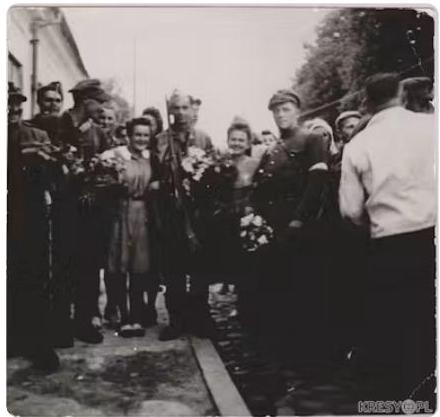

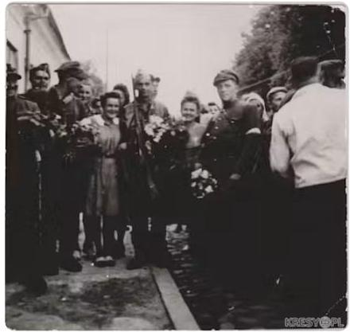

－Biogram：ppor．Józef Majerski ps．„Marek”（lub „Józef＂） „Józef”） Rola：Oficer wywiadu i zastępca
Rola：Oficer wywiadu i zastępca
Rola：Oficer wywiadu i zastępca
Rola：Oficer wywiadu i zastępca
Rola：Oficer wywiadu i zastępca
Rola：Oficer wywiadu i zastępca
Rola：Oficer wywiadu i zastępca Rola：Oficer wywiadu i zastępca Rola：Oficer wywiadu i zastępca dowódcy w strukturach lokalnei dowódcy w strukturach lokalnei
dowódcy w strukturach lokalnej dowódcy w strukturach lokalnej dowódcy w strukturach lokalnej dowódcy w strukturach lokalnej dowodcy w strukturach lokalne］
dowodcy w strukturach lokalne］ dowodcy W strukturach lokalne］ AK．
AK． AK． AK． AK． AK． AK．
AK．
AK．
ΑΚ． AK．
AK．
Biogram：Kluczowa postać Biogram：Kluczowa postać
Biogram：Kluczowa postać
Biogram：Kluczowa postać operacji „Burza” w Lubartowie． operacji „Burza” w Lubartowie． operacji „Burza” w Lubartowie． operacji „Burza” w Lubartowie． operacji „Burza w Lubartowie． флад＂Внга W Lubartaw． Odpowiedzialny za Odpowiedzialny za
Odpowiedzialny za Odpowiedzialny za
rozpoznanie sił niemieckich w rozpoznanie sił niemieckich w
rozpoznanie sił niemieckich w rozpoznanie sił niemieckich w rozpoznanie sił niemieckich w
rozpoznanie sił niemieckich w ஒ никулограногоного mieście przed atakiem 22 lipca mieście przed atakiem 22 lipca mieście przed atakiem 22 lipca miescie przed atakiem 22 lipca I II 1944 Desitive of 1944 r．Dzieki jego precyzyjnym 1944 r．Dzięki jego precyzyjnym 1944 r．Dzięki jego precyzyjnym 1944 ．Dzięki jego precyzyjnym meldunkom plutony Szarego＂i meldunkom，plutony „Szarego” i meldunkom，plutony „Szarego” i meldunkom，plutony „Szarego” i HELLIN，DE ＂＂＂ „Jura” wiedziały，gdzie znajdują „Jura” wiedziały，gdzie znajdują „Jura” wiedziały，gdzie znajdują „ura wiedziały，gdzie znajdują się słabe punkty okupanta．Brał się słabe punkty okupanta．Brał się słabe punkty okupanta．Brał się słabe punkty okupanta．Brał bezpośredni udział w bezpośredni udział w bezpośredni udział w bezposredrillarar w
bezposredrillarar w
opanowywaniu strategicznych
opanowywaniu strategicznych
opanowywaniu strategicznych opanowywaniu strategicznych gmachów． gmachów． gmachów．
Ciekawostka（do Audio）： Ciekawostka（do Audio）：
Ciekawostka（do Audio）：
Ciekawostka（do Audio）： Clekawosked（do， Specialista od działań Specjalista od działań Specjalista od działań Specjalista od dziatan zakulisowych．To jego praca zakulisowych．To jego praca zakulisowych．To jego praca

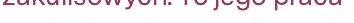

никтен pozwoliła uniknąć większych pozwoliła uniknąć większych pozwoliła uniknąc większych strat wśród ludności cywilnei strat wśród ludności cywilnei strat wśród ludności cywilnej strat wsrod ludnosci cywine］ podczas walk o miasto． podczas walk o miasto． podczas walk o miasto．
Źródło．J Mmała Woina
Źródło：J．Dumało，Wojna
Źródło：J．Dumało，Wojna i Zrodło：J．Dumało，Wojna i Z okupacia．．．／Dokumentacia okupacja．．．／Dokumentacja orupacja．．．Dora archiwalna AK． archiwalna AK． archiwalna AK．Ruch Oporu
Ruch Oporu
Ruch Oporu

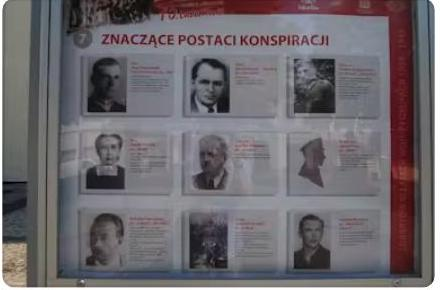

E
E
E
E
E

E
E
E
E
E
E
E
E
E
E
－
＇
＇

Eдатавии ⇒＝
RECH OPORU

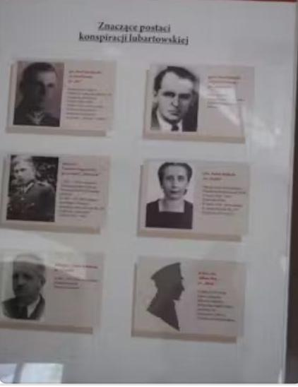

Click me
日
$\theta$$f_{\bullet}$
E
$f_{\bullet}$⁍

Click me
目
$f_{\bullet}$
目
$f_{\bullet}$⁍

| Piotr Mierzwiński ps．Wierny＂ |  |
| --- | --- |
| Jerzy Ślaski |  |
| Roman Domański |  |

Marian Pawełczak

| 日 | Click me | 日 | $f_{\bullet}$ | E | $f_{\bullet}$ | $f_{\bullet}$ |
| --- | --- | --- | --- | --- | --- | --- |
| 日 | Click me | （2） | $f_{\bullet}$ |  | $f_{\bullet}$ | $f_{\bullet}$ |

Marlar ，pse ， „Morwa”，to doświadczony partyzant i jedna z najbardziej wyrazistych postaci lubartowskiego podziemia niepodległościowego．Wykazał się wybitnymi zdolnościami dowódczymi oraz zmysłem taktycznym jako główny strateg organizator brawurowej ucieczki z pilnie strzeżonego obozu NKWD w Skrobowie，która miała miejsce w mroźna noc 27 marca 1945 roku．

Dzięki doskonałej znajomości topografii terenu oraz precyzyjnemu wykorzystaniu momentu zmiany warty，„Morwa” zdołał przeprowadzić około 50 żołnierzy Armii Krajowej oraz Batalionów Chłopskich przez linie zabezpieczeń i rozcięte druty，dając im szansę na przetrwanie w okolicznych lasach．

Więzien obozu NKWD w Skrobowie，ktory odegrał fundamentalną rolę jako wewnętrzny łącznik i organizator konspiracyjnych struktur struktur obozowych bezpośrednio przed ucieczką 27 marca 1945 roku． Odpowiadał za skoordynowanie działań osadzonych żołnierzy Armii Krajowej i Batalionów Chłopskich wewnątrz baraków，precyzyjne wyznaczenie momentu uderzenia na wartę oraz sprawne przeprowadzenie więźniów przez zabezpieczenia obozowe pod osłoną nocy．Jego odwaga i zimna krew zadecydowały o powodzeniu planu．

Paweł Kalinowski pełnił kluczową funkcję koordynatora struktur ucieczki bezpośrednio wewnątrz obozu NKWD w Skrobowie．Jego zadaniem było utrzymanie bezwzględnej dyscypliny， precyzyjne przekazywanie rozkazów pomiedzy osadzonymi oraz zsynchronizowanie działań z planem taktycznym przygotowanym na zewnątrz．

To dzięki jego opanowaniu i konspiracyjnemu doświadczeniu udało się zachować pełną tajemnice aż do momentu uderzenia，co uniemożliwiło sowieckiemu aparatowi bezpieczeństwa skuteczne przeciwdziałanie ucieczce 48 osadzonych．

Stopień_Imię_Nazwisko	Pseudonim	Biogram	Słowa_Klucze	Opis_Wizualny
kpt. Kazimierz Rzaniak	Garda	Oficer 27. Wołyńskiej Dywizji Piechoty AK, dowódca zgrupowania, w skład którego wchodził batalion „Korda”. Odpowiedzialny za koordynację działań na styku Lubartowa i Kozłówki; brał udział w trudnych rozmowach z dowództwem sowieckim przed rozbrojeniem.	Dowódca Zgrupowania, 27. WDP AK, Rozmowy z sowietami	Mężczyzna w pełnym umundurowaniu oficerskim, wysoka czapka rogatywka, pas główny z koalicyjką, postawa wyprostowana, twarz o ostrych, żołnierskich rysach.
por. rez. Jan Królikowski	Taran	Komendant Obwodu Lubartów w początkowym okresie (październik / listopad 1939 - 1940 r.). Jeden z pierwszych organizatorów oporu zbrojnego na ziemi lubartowskiej, kładący podwaliny pod późniejszą strukturę AK.	Pierwszy organizator, „Taran”, Początki konspiracji	Sylwetka mężczyzny w mundurze (zdjęcie profilowe), wyraźny zarys oficerskiej czapki, ujęcie o charakterze archiwalnym, kontrastowe.

/gallery view

[https://app.notion.com](https://app.notion.com)

Stopień_Imię_Nazwisko	Pseudonim	Biogram	Słowa_Klucze	Opis_Wizualny
kpt. Kazimierz Rzaniak	Garda	Oficer 27. Wołyńskiej Dywizji Piechoty AK, dowódca zgrupowania, w skład którego wchodził batalion „Korda”. Odpowiedzialny za koordynację działań na styku Lubartowa i Kozłówki; brał udział w trudnych rozmowach z dowództwem sowieckim przed rozbrojeniem.	Dowódca Zgrupowania, 27. WDP AK, Rozmowy z sowietami	Mężczyzna w pełnym umundurowaniu oficerskim, wysoka czapka rogatywka, pas główny z koalicyjką, postawa wyprostowana, twarz o ostrych, żołnierskich rysach.
por. rez. Jan Królikowski	Taran	Komendant Obwodu Lubartów w początkowym okresie (październik / listopad 1939 - 1940 r.). Jeden z pierwszych organizatorów oporu zbrojnego na ziemi lubartowskiej, kładący podwaliny pod późniejszą strukturę AK.	Pierwszy organizator, „Taran”, Początki konspiracji	Sylwetka mężczyzny w mundurze (zdjęcie profilowe), wyraźny zarys oficerskiej czapki, ujęcie o charakterze archiwalnym, kontrastowe.